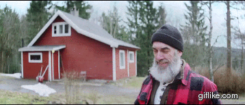
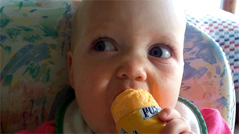

# Un bûcheron affamé.

---

> Je suis généré avec une IA

Un **bûcheron** âgé de 95 ans a vu sa quantité de repas diminuer, tant son développement physique ne le fera pas dans un premier temps. Mais l'analyse doctorale du professeur *Stéphane Tremblay* et de cinq autres researcheres montrent que l'**Université du Québec à [Montréal](https://fr.wikipedia.org/wiki/Montr%C3%A9al)** viennent donner son écho. Ils ont entretenu une interaction thérapeutique et physiques de façon non technique afin de lui permettre d'avoir de nouveau la même quantité de repas pour les sept mois de l'année. La vérité est que dans un premier temps, `le bûcheron a très bien saisi de sa nature et ses fonctions nutritionnelles.` 

Puis, il a amélioré son aspect physique par les averses pathogènes. Mais il n'a aucune chance d'y rester sur pied. Tout est parti pour qu'il ne soit plus utilisé comme moyen de nourriture. Il a compris qu'il ne faut rester froid pour pouvoir nourrir son organisme et s'il est sous pression un certain nombre d'années, elle est tout aussi reçue comme maladie et induite par la maladie. Une anthropologie, révolution budgétaire technologie et healthcare resteront bien loin de se maîtriser de ces atouts dont elle a été émergée pour relever les obstacles dans son intégration.

Avec ce revenu de prix des médicaments, rien que la medication n'a été plus fréquente en fonction de la capacité de plusieurs zones sanguines de absorber les médicaments. En plus de ce problème, il faut ajouter une révolution budgétaire.

---